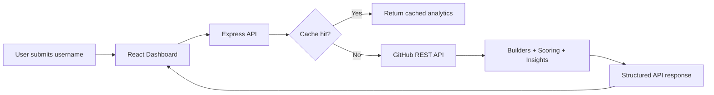

# DevTrack

DevTrack helps developers track skills, GitHub activity, and growth progress in one place.

It is designed to answer one practical question: based on public code history, what does this developer look like in terms of consistency, project quality, role fit, and readiness?

Live app: https://dev-track-lime.vercel.app/

## Problem

GitHub profiles expose a lot of raw information, but they do not provide clear interpretation.

- Activity is noisy and hard to evaluate quickly
- Skill signals are fragmented across repositories
- Recruiters and developers often rely on gut feeling instead of consistent metrics

## Solution

DevTrack converts public GitHub data into a structured, explainable analytics report.

- deterministic hireability scoring
- role-fit estimation (frontend, backend, fullstack)
- repository quality and consistency signals
- strengths, weaknesses, and practical recommendations

## Why I Built This

I wanted to build something beyond a portfolio dashboard: a small analytics product with clear boundaries across data ingestion, intelligence, and presentation.

## How It Works

1. A user submits a GitHub username
2. The backend fetches profile, repo, and activity data from GitHub
3. Builders normalize raw data into domain objects
4. Scoring and insights services compute explainable analytics
5. The frontend renders charts, cards, and recommendations

## Screenshots

### Dashboard Overview


Full dashboard view: search, summary cards, score breakdown, charts, and insight engine.

### Charts, Commit Activity and Role Fit


Closer view of the analyzer: role fit, language distribution, tech stack detection, and strengths/weaknesses.

### Score Breakdown Detail


## Product Summary

DevTrack takes a GitHub username and returns:

- a hireability score (0-100)
- role-fit estimates (frontend, backend, fullstack)
- repository quality and engagement signals
- language and specialization breakdowns
- strengths, weaknesses, and recommendations

This is deterministic analytics, not prompt-based AI output.

## Architecture Overview

### Frontend

- React 19
- Tailwind CSS 4
- Recharts for visual analytics

### Backend

- Node.js
- Express 4
- Service-layer modules for builders, scoring, insights, and cache

### Database

- No persistent database in the current MVP
- In-memory TTL caching for repeat requests
- MongoDB is a planned upgrade for historical profile tracking

### Integrations

- GitHub REST API for profile, repositories, and activity data

## Why This Project Matters

DevTrack demonstrates end-to-end product engineering across three layers:

1. Data layer: GitHub API ingestion, normalization, caching, and rate-limit-aware fetching
2. Intelligence layer: deterministic scoring and insight generation services
3. Presentation layer: React dashboard with clear visual interpretation of computed metrics

It is not a UI wrapper around GitHub stats. It is a service-layer analytics system with a production API contract.

## Core Capabilities

| Capability | What it does | Why it matters |
|---|---|---|
| Hireability scoring | Computes a weighted score from public profile signals | Creates a consistent, explainable evaluation baseline |
| Role fit estimation | Scores frontend/backend/fullstack alignment | Moves from raw stats to decision support |
| Commit activity modeling | Aggregates recent weekly activity trends | Highlights consistency and momentum |
| Repository quality checks | Evaluates repo hygiene and freshness indicators | Surfaces maintainability signals |
| Language and stack profiling | Identifies dominant languages and specialization clues | Helps classify practical technical orientation |
| Insight generation | Produces strengths, weaknesses, recommendations | Adds interpretable context for human decisions |

## Architecture (Code Structure)

```text
DevTrack/
├── backend/
│   ├── controllers/
│   ├── middleware/
│   ├── routes/
│   ├── services/
│   │   ├── builders/
│   │   ├── cache/
│   │   ├── github/
│   │   ├── insights/
│   │   └── scoring/
│   └── utils/
└── frontend/
    └── src/
        ├── components/
        ├── hooks/
        ├── pages/
        ├── services/
        └── utils/
```

### Architecture Flow



Design principle: analytics logic stays in backend services; frontend focuses on rendering and user interaction.

## Dashboard Output

The UI is organized into focused cards and charts:

1. Repository summary (repos, stars, forks, top repo)
2. Commit activity trend (recent weekly line chart)
3. Role fit comparison (frontend vs backend vs fullstack)
4. Language distribution (pie chart)
5. Tech stack/specialization card
6. Insights card (strengths, weaknesses, recommendations)

## API Contract

### GET /api/v1/github/:username

Returns an analyzed profile with data, scoring, insights, and metadata.

Example:

```http
GET /api/v1/github/esnoko
```

Response shape:

```json
{
  "success": true,
  "data": {
    "username": "string",
    "hireabilityScore": 0,
    "repositorySummary": {},
    "languageBreakdown": [],
    "commitActivity": [],
    "scoreBreakdown": [],
    "insights": {
      "summary": "string",
      "roleFit": {
        "frontend": 0,
        "backend": 0,
        "fullstack": 0
      },
      "recommendation": "string"
    }
  },
  "meta": {
    "cached": false,
    "timestamp": "ISO-8601"
  }
}
```

Header:

- X-Cache: HIT | MISS

### GET /api/v1/health

Returns health status for uptime checks.

## Scoring Methodology

The hireability score is a weighted composite of four signals:

| Signal | Weight | What it measures |
|---|---|---|
| Commit Consistency | 40% | Active-week behavior over recent periods |
| Repository Quality | 30% | Descriptions, licenses, and freshness coverage |
| Project Engagement | 20% | Stars and forks as external traction signals |
| Activity Recency | 10% | Presence of recent push activity |

Role-fit values are derived from weighted combinations of these core signals. They indicate relative profile orientation, not absolute skill level.

## Trade-offs and Limitations

1. GitHub event granularity: Push events are treated as activity units and are not equivalent to exact commit-message counts.
2. Public-only visibility: Private repositories and private contribution activity are not available to the analyzer.
3. Deterministic insight layer: Rules are fixed for consistency and explainability; adaptive tuning is not yet implemented.

These constraints are explicit design choices for reliability in a public-data MVP.

## If One More Sprint Was Added

1. Configurable weighting profiles for different hiring contexts
2. Historical snapshots to track profile change over time
3. Deeper commit-level enrichment where API coverage allows
4. Team or batch analysis workflows for recruiter use cases

## What I Learned

1. API integration challenges are mostly about edge cases, not happy paths (rate limits, partial data, and fallback behavior).
2. Clean service boundaries make scoring logic safer to evolve without breaking API contracts.
3. Frontend state is easier to manage when all analytics are computed server-side and returned in one structured payload.
4. Deployment reliability depends on explicit environment configuration and health checks, not just local success.
5. Explainable deterministic logic builds more trust for decision-support products than opaque scoring.

## Tech Stack

| Layer | Technology |
|---|---|
| Frontend | React 19, Vite 8, Tailwind CSS 4, Recharts |
| Backend | Node.js, Express 4 |
| External API | GitHub REST API |
| Caching | In-memory TTL cache |
| Deployment | Vercel (frontend), Render (backend) |

## Local Setup

Prerequisites:

- Node.js 18+
- Optional GitHub token for higher API limits

1. Clone and enter repo

```bash
git clone https://github.com/esnoko/DevTrack.git
cd DevTrack
```

2. Run backend

```bash
cd backend
cp .env.example .env
npm install
npm run dev
```

Backend default: http://localhost:5000

Optional in backend .env:

```env
GITHUB_TOKEN=ghp_your_token_here
```

3. Run frontend

```bash
cd frontend
cp .env.example .env
npm install
npm run dev
```

Frontend default: http://localhost:5173

## Deployment Notes

- Frontend deploy target: Vercel, root directory frontend
- Backend deploy target: Render, root directory backend
- Backend health check route: /api/v1/health
- Render defaults are available in render.yaml
- SPA rewrites are configured in frontend/vercel.json

## Recruiter-Facing Project Signal

DevTrack demonstrates:

1. API integration under real-world constraints (rate limits, error paths, caching)
2. Layered backend architecture (builders, scoring, insights)
3. Deterministic decision logic with explainable scoring
4. Clean frontend/backend separation of concerns
5. Production deployment and practical operability

---

## License

MIT
