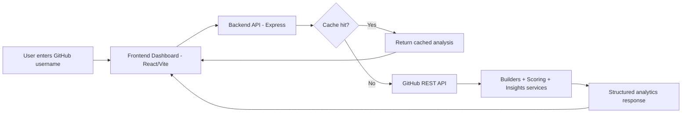

# DevTrack

> **Profile → Insights.** Enter any GitHub username and get a comprehensive developer analytics report in seconds.

DevTrack generates a "developer readiness report" by analyzing public GitHub profiles. It surfaces **commit consistency**, **language expertise**, **project quality**, **contribution activity**, and **role-fit recommendations** — all in one dashboard.

Think: GitHub profile review tool for employers, career coaching, or self-assessment.

**👉 Try it:** https://dev-track-lime.vercel.app/

---

## 🎯 What DevTrack Analyzes

When you enter a GitHub username, the platform computes:

| Metric | What it shows | Example insight |
|---|---|---|
| **Hireability Score** | 0–100 rating based on GitHub signals | "Ready for junior-level applications" |
| **Commit Consistency** | Active weeks over 12-week ∆ | "Commits 6 out of 12 weeks" |
| **Top Languages** | Pie chart of language distribution | "60% JavaScript, 30% Python" |
| **Tech Stack Specializations** | Frameworks & tools detected from repos | "Expert: React, Proficient: Node.js, Experienced: AWS" |
| **Repository Quality** | Descriptions, licenses, freshness | "8/10 repos have descriptions" |
| **Role Fit** | Frontend / Backend / Fullstack scores | "Backend-leaning (score: 68)" |
| **Strengths & Weaknesses** | AI-generated actionable insights | ✔ Strong consistency / ✖ Limited collaborations |
| **Activity Trends** | 12-week commit activity chart | "5–8 commits per active week" |

---

## 📊 Dashboard Preview

The DevTrack dashboard displays:
1. **Repository Summary** — Total repos, stars, forks, top project
2. **Commit Activity Chart** — Week-over-week line graph (last 12 weeks)
3. **Role Fit Comparison** — 3-bar chart: frontend vs backend vs fullstack
4. **Top Languages Chart** — Pie breakdown of language distribution
5. **Tech Stack Card** — Framework & framework expertise levels (React, Django, etc.)
6. **Developer Insights** — Text-based strengths, weaknesses, and personalized recommendations

All computed server-side. No client-side guessing.

---

## Screenshots

Current screenshots show the live dashboard layout, analyzer cards, and the scoring + insight experience.

### Dashboard Overview


Full dashboard view: search, summary cards, score breakdown, charts, and insight engine.

### Charts and Insights


Closer view of the analyzer: role fit, language distribution, tech stack detection, and strengths/weaknesses.

### Score Breakdown Detail


Shows the scoring logic more clearly: the weighted signals that make up the hireability score.

---

## ✨ Feature Breakdown

### 1) Search + Analysis Pipeline
Enter any public GitHub username and DevTrack generates a full analytics profile in one request.

### 2) Score Breakdown (0-100)
The hireability score is computed from weighted signals, then displayed with a clear category-level breakdown:
- Commit consistency (40)
- Repository quality (30)
- Project engagement (20)
- Activity level (10)

### 3) Visual Intelligence Layer
The dashboard translates raw GitHub data into readable charts and cards:
- Commit activity trend
- Role fit comparison (frontend/backend/fullstack)
- Top language distribution (pie chart + stable custom legend)
- Tech stack specialization with expertise tiers

### 4) Insight Engine
DevTrack turns metrics into interpretation:
- strengths
- weaknesses
- recommendation

### 5) Performance + Reliability
Server-side caching and robust error handling keep response times stable and protect against API pressure.

---

## 💼 Why This Project Matters

**For Employers & Interviewers:**
- ✅ **API Integration**: Real consumption of GitHub's REST API (rate limiting, pagination, error handling)
- ✅ **Data Pipeline**: Multi-stage transformation (fetch → parse → score → enhance → return)
- ✅ **Scoring Algorithm**: Domain logic with weighted signals (replaces gut feeling with data)
- ✅ **Full-Stack Ownership**: Backend scoring + frontend visualization (one person, all layers)
- ✅ **Production Design**: Caching, error handling, structured response formats
- ✅ **User Experience**: Clean UI that communicates complex data (not just raw dumps)

**Real-world parallel:** This is how recruitment platforms, DevTools startups, and analytics dashboards work.

---

## Tech Stack

| Layer | Technology | Why chosen |
|---|---|---|
| **Frontend** | React 19 + Vite 8 | Modern, fast, component-based UI |
| **Styling** | Tailwind CSS v4 | Rapid, consistent design system |
| **Charts** | Recharts | React-native, responsive, minimal setup |
| **Backend** | Node.js 22 + Express 4 | JavaScript full-stack, async-first |
| **External API** | GitHub REST API v3 | Public, no auth required, comprehensive |
| **Caching** | In-memory TTL | Fast repeat queries without hitting GitHub limits |
| **Deployment** | Vercel (frontend) + Render (backend) | Frictionless, fast cold starts, free tier |

**Status:** Production-ready MVP

**Live endpoints:**
- Frontend: https://dev-track-lime.vercel.app/
- Backend health: https://devtrack-ejfe.onrender.com/api/v1/health

---

## Architecture

```
DevTrack/
├── backend/                  # Express API server
│   ├── controllers/          # Route handlers
│   ├── middleware/           # Error handling, 404
│   ├── routes/               # API route definitions
│   ├── services/
│   │   ├── builders/         # Transform raw GitHub data into domain objects
│   │   ├── cache/            # In-memory TTL cache
│   │   ├── github/           # GitHub API client
│   │   ├── insights/         # Text insight generation
│   │   └── scoring/          # Hireability + role-fit scoring
│   └── utils/                # Shared response helpers
│
└── frontend/                 # Vite + React SPA
    └── src/
        ├── components/
        │   ├── cards/        # HeaderCard, RepoSummaryCard, InsightsCard
        │   ├── charts/       # CommitChart (LineChart), RoleFitChart (BarChart)
        │   └── common/       # SearchBar, Loader, ErrorMessage
        ├── hooks/            # useGithubProfile (fetch / loading / error / abort)
        ├── pages/            # Dashboard
        ├── services/         # githubApi.js (HTTP client)
        └── utils/            # scoreTone.js (threshold color logic)
```

### Simple Architecture Diagram



**Design principle:** the backend is the analytics engine. The frontend is a display platform. Zero business logic lives in React components.

---

## 🚀 What Makes DevTrack Different

1. It does not stop at raw GitHub stats; it computes explainable scoring and role-fit interpretation.
2. It combines quantitative metrics and qualitative insights in a single view.
3. It detects technology specialization (framework-level) rather than showing only language percentages.
4. It is built as a layered analytics system (builders, scoring, insights) instead of a simple data fetch UI.
5. It is production-deployed and interview-ready with real API limits, caching, and failure handling.

---

## API

### `GET /api/v1/github/:username`

Fetches and analyzes a GitHub user profile.

Example request:

```http
GET /api/v1/github/esnoko
```

Example response shown for documentation purposes. Actual analytics vary based on live GitHub activity, cache state, and scoring updates.

**Response:**
```json
{
  "success": true,
  "data": {
    "username": "esnoko",
    "hireabilityScore": 30,
    "repositorySummary": {
      "totalRepositories": 7,
      "totalStars": 5,
      "totalForks": 0,
      "mostStarredRepository": {
        "name": "HexSoftwares_Exclusive-Music-player",
        "url": "https://github.com/esnoko/HexSoftwares_Exclusive-Music-player"
      }
    },
    "languageBreakdown": [
      {
        "language": "CSS",
        "repositoryCount": 4,
        "percentage": 57.14
      }
    ],
    "commitActivity": [
      { "week": "2026-W18", "commits": 0 },
      { "week": "2026-W19", "commits": 8 },
      { "week": "2026-W20", "commits": 8 }
    ],
    "scoreBreakdown": [
      { "category": "Commit Consistency", "score": 7 },
      { "category": "Repository Quality", "score": 14 }
    ],
    "insights": {
      "summary": "Early to mid-stage profile; improving consistency and quality would help most.",
      "roleFit": { "frontend": 33, "backend": 28, "fullstack": 31 },
      "recommendation": "Not ready for applications; focus on building consistent projects for frontend roles."
    }
  },
  "meta": {
    "cached": false,
    "timestamp": "2026-05-13T14:32:00.000Z"
  }
}
```

**Headers:**
- `X-Cache: HIT | MISS` — whether the result was served from cache

---

### `GET /api/v1/health`

Returns server status.

---

## Scoring Methodology

The **hireability score** (0–100) is a weighted composite of four signals computed entirely from public GitHub data:

| Signal | Weight | What it measures |
|---|---|---|
| Commit Consistency | 40% | Active weeks ratio and longest inactivity gap over 12 weeks |
| Repository Quality | 30% | Descriptions, licenses, and recently-updated repos ratio |
| Project Engagement | 20% | Stars + forks as a proxy for community traction |
| Activity Recency | 10% | Whether the developer pushed code in the last 4 weeks |

**Role Fit** scores (Frontend / Backend / Fullstack) are derived from weighted combinations of the engagement, quality, and consistency signals — and reflect relative aptitude, not absolute skill.

Score thresholds:
- 🟢 70–100 — strong
- 🟡 40–69 — developing
- 🔴 0–39 — early stage

> **Note:** Scores are based solely on public events and repository metadata available through the GitHub REST API. Commit counts reflect push events (1 push = 1 unit), not commit message counts. Private repositories are not analyzed.

---

## 🗺️ Roadmap

**Completed:**
- ✅ GitHub REST API integration + error handling
- ✅ Scoring pipeline (4-signal hireability formula)
- ✅ Role-fit analysis (frontend/backend/fullstack)
- ✅ Insights generation (strengths/weaknesses)
- ✅ React dashboard with 4 chart types
- ✅ Server-side caching (60s TTL)
- ✅ Production deployment on Vercel + Render

**Next priorities:**
- 🔄 **Authentication** (GitHub OAuth or JWT)
- 🔄 **History tracking** (store profiles over time, see growth trends)
- 🔄 **Contribution heatmap** (like GitHub's calendar, but better analysis)
- 🔄 **Batch reports** (analyze multiple users, export to PDF)
- 🔄 **Email alerts** (notify when watched profiles level up)

---

## Local Setup

### Prerequisites

- Node.js 18+
- A GitHub account (optional — for a Personal Access Token to avoid rate limits)

### 1. Clone the repository

```bash
git clone https://github.com/esnoko/DevTrack.git
cd DevTrack
```

### 2. Backend

```bash
cd backend
cp .env.example .env
npm install
npm run dev
```

The API will be available at `http://localhost:5000`.

**Optional:** Add your GitHub token to `backend/.env` to raise the rate limit from 60 to 5,000 requests/hour:
```
GITHUB_TOKEN=ghp_your_token_here
```
Create a token at [github.com/settings/tokens](https://github.com/settings/tokens) — no scopes required for public data.

### 3. Frontend

```bash
cd frontend
cp .env.example .env
npm install
npm run dev
```

The app will be available at `http://localhost:5173`.

---

## Deployment

Quick ship order:
1. Deploy backend on Render
2. Deploy frontend on Vercel
3. Add live links above

### Frontend → Vercel

1. Push to GitHub
2. Import the repository in [vercel.com](https://vercel.com)
3. Set **Root Directory** to `frontend`
4. Add environment variable: `VITE_API_BASE_URL=https://devtrack-ejfe.onrender.com/api/v1`
5. (Optional) `frontend/vercel.json` is already included for SPA routing

### Backend → Render

1. Create a new **Web Service** on [render.com](https://render.com)
2. Set **Root Directory** to `backend`
3. Build command: `npm install`
4. Start command: `npm start`
5. Add environment variables: `GITHUB_TOKEN`, `CACHE_TTL_SECONDS=300`, `PORT=10000`
6. Test health endpoint: `https://your-backend.onrender.com/api/v1/health`

### One-Click Infra Config

- `render.yaml` included at repo root for Render service defaults
- `frontend/vercel.json` included for Vercel frontend build + SPA rewrites

---

## CV-Ready Highlights

**What this project signals to employers:**

1. **API Integration** — Fetches 1000s of events from GitHub, handles rate limits, retries, and edge cases
2. **Data Transformation** — Builds domain objects from raw API responses (builders layer)
3. **Scoring Algorithm** — Implements weighted multi-signal hireability formula (not magic, all documented)
4. **Pattern Detection** — Framework & specialization recognition from repository names, descriptions, and language choices
5. **Full-Stack Ownership** — Backend scoring + React frontend (not "I just styled someone else's backend")
6. **Production Design** — Caching, error handling, structured responses, environment-based config
7. **Thoughtful UX** — Complex data (commit trends, role fit, tech stack) translated into clear visualizations
8. **DevOps Basics** — Deployed to Vercel + Render, passes the "does it actually work in public?" test

**Why Tech Stack Profiling Matters:**
- Most developers just see "languages" on their profile
- DevTrack goes deeper: detects **expertise levels** (Expert / Proficient / Experienced / Beginner)
- Recognizes **frameworks** (React, Django, FastAPI, Kubernetes, etc.) — the actual specialization
- Organizes by role **categories** (Frontend, Backend, DevOps, ML/Data) — tells the real story

**Real-world relevance:** This mirrors the architecture of recruitment platforms (Levels.fyi, AlgoExpert), DevTools SaaS (Segment, Mixpanel), and career coaching apps (levels-fyi, gittrack).

---

---

## Future Improvements

- **Profile Comparison** — side-by-side analytics for two GitHub users
- **GitHub OAuth** — analyze private repos, higher rate limits, user sessions
- **Database Persistence** — store analyses over time, show score trends
- **Streak Analysis** — detect contribution streaks and gaps with pattern recognition
- **Language Breakdown Chart** — visualize language distribution across repositories
- **CI/CD** — GitHub Actions for lint, type-check, and build validation
- **Testing** — Vitest for frontend utils, Supertest for API routes

---

## License

MIT
